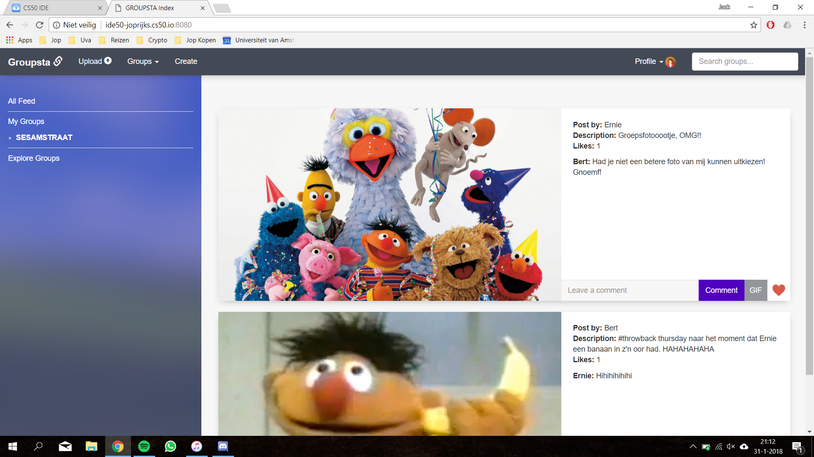

# Groupsta
Een photosharing platform met groepen.

## Teamleden
- Sjoerd Rienks, 11773138
- Patrick Carbin, 5947480
- Sjors van der Sluis, 10784489
- Jop Rijksbaron, 11685514

## Samenvatting
Het idee achter Groupsta zijn de groepen, je deelt de foto niet met je volgers zoals bij Instagram maar binnen één van je communities om groepen mensen weer met elkaar in contact te brengen. De nadruk bij Groupsta ligt bij de comments onder de foto's. Communities kunnen simpel gemaakt worden en een community mag overal over gaan, denk bijvoorbeeld aan een sportvereniging, vriendengroep, evenement of bijvoorbeeld een bejaardentehuis. Als iemand een foto plaatst in zo’n groep kan iedereen die lid is van die groep het bekijken/liken/delen of reageren.

## Screenshot

## Features
- Foto's posten
    - In een gevolgde groep naar keuze
    - Met beschrijving
- Groepen aanmaken
    - Titel en beschrijving geven
- Groepen volgen
- Groepen onvolgen
- Comments plaatsen
- Gif's uit giphy plaatsen als comments
- Foto's liken
- Het liken van foto's ongedaan maken
- Account instellingen
    - Wachtwoord veranderen
    - Username veranderen
- Zoekfunctie met livesearch
- Feed bekijken
    - Van één groep
    - Van alle groepen die de gebruiker volgt
- Groepen ontdekken
    - Pagina met 5 randompagina's

## Inbreng
Sjoerd Rienks,
    - livesearch
    - post
    - css

Sjors van der Sluis,
    - Settings
    - Comments
    - Register & Login

Patrick Carbin
    - HTML - pagina's
    - Navigatiebalk
    - Design

Jop Rijksbaron
    - Groepen volgsysteem
    - Like
    - Feed laden
    - Design

### Repository
helpers.py
    - Login required functie

groupsta.db
- De database van de website

Models:
- Users
    - Register
    - Login
    - Change password
    - Change username
    - Profile feed
- Groups
    - Create
    - Follow
    - Explore groups
    - Load all groups
    - Load all posts of a group
    - Groupinfo
    - Name to group_id converter
    - Followed
    - Main feed
    - Follow check
- Posts
    - Upload
    - Load groups followed by user
    - Comment text
    - Comment Gif
    - Load comments
    - Like

Static:
- Website afbeeldingen
- IMG
    - Geuploade afbeeldingen

Templates:
- Alle html-bestanden van de website